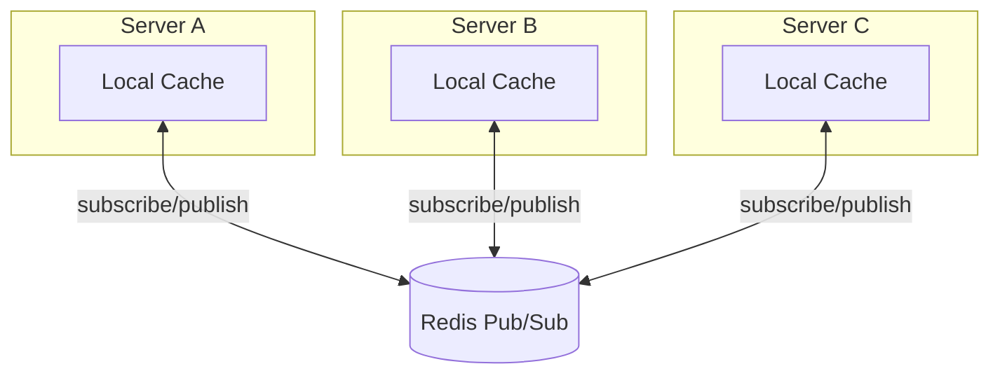

# Distributed Cache

분산 서버 환경에서 로컬 캐시의 일관성을 유지하기 위한 Go 기반 캐시 라이브러리입니다.  
Redis Pub/Sub을 활용하여 여러 서버 인스턴스 간 캐시 무효화를 동기화합니다.

레퍼런스에 대한 학습이 주안점입니다.

## 레퍼런스

- [Distributed Cache 도입기 (1): Redis Pub/Sub을 이용한 인터페이스 설계](https://channel.io/ko/team/blog/articles/tech-distributed-cache-1-67a392c5)
- [Distributed Cache 도입기 (2): 워크플로우 캐시 리팩토링](https://channel.io/ko/team/blog/articles/tech-distributed-cache-2-f77c0868)

## 목표

- 분산 서버 환경에서 로컬 캐시 일관성 보장
- Redis Pub/Sub 기반 캐시 무효화 전파
- 인메모리 캐시(Ristretto) 활용

## 아키텍처

캐시가 무효화되면 Redis Pub/Sub을 통해 모든 서버에 무효화 이벤트를 전파합니다.

## 기술 스택

| 기술 | 버전 | 용도 |
|------|------|------|
| Go | v1.25 | 메인 언어 |
| Redis | 7.0 | Pub/Sub 메시지 브로커 |
| Ristretto | v2.4.0 | 고성능 로컬 캐시 |
